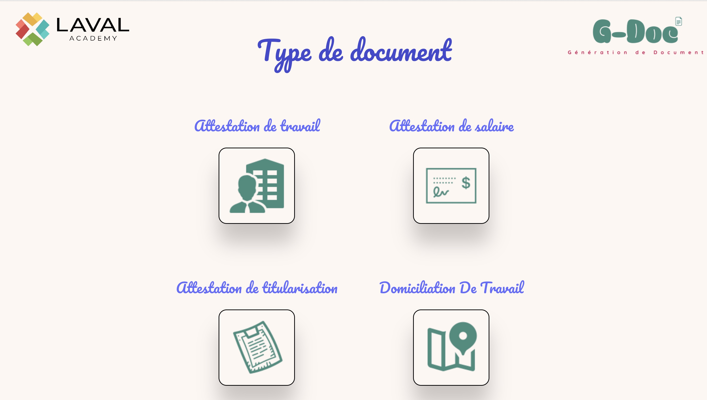
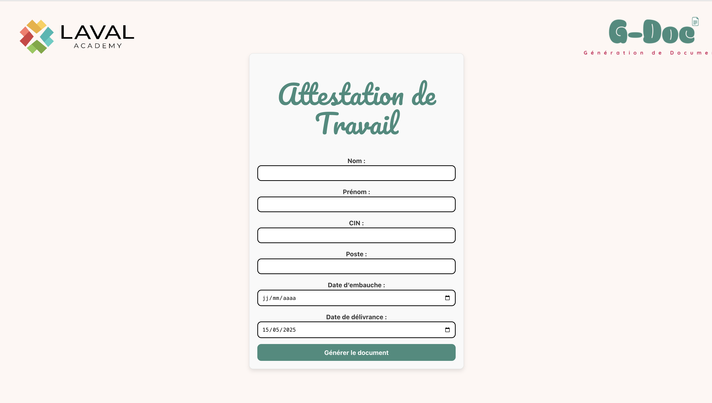

# G-Doc

## 🎓 Client:

Laval Academy

## 🎯 Objectif de l'application:

Développer une plateforme interne permettant la **génération automatisée de documents administratifs** au format PDF pour les salariés de l'école, à partir des informations saisies.

## 🛠️ Technologies utilisées:

- React
- JavaScript (avec possibilité future de passage à TypeScript)
- Vite
- CSS Modules
- React Router DOM

## 📋 Fonctionnalités développées

- [x] **Structure de projet** avec Vite + React + CSS Modules
- [x] **Intégration d’un Header fixe** avec double logo (Laval Academy + G-Doc)
- [x] **Création d’une page d’accueil (Options)** listant les types de documents administratifs
- [x] **Navigation par React Router** entre la page principale et les pages de documents
- [x] **Pages créées pour chaque document :**
  - Attestation de travail
  - Attestation de salaire
  - Attestation de titularisation
  - Domiciliation de travail
- [x] **Formulaires de saisie personnalisés** pour chaque document
- [x] **Génération automatique de documents PDF :**
  - Intégration du logo officiel Laval Academy dans les PDF
  - Texte personnalisé avec les informations du salarié
  - Police **Courier** pour un rendu administratif
  - Titre principal **gras et souligné**
  - Texte aligné et marges définies
  - Footer personnalisé avec date et signature
- [x] **Responsive design** entièrement repensé :
  - Header responsive
  - Page Options responsive (mobile, tablette, desktop)
- [x] **Animation au survol** sur les images et titres des documents
- [x] **Déploiement de la version privée**: Une version privée a été développer avec le cachet de l'école placer en dessous du libellé `Signature`.

## 🚧 Prochaines étapes

- [ ] Intégration d’une base de données ou stockage local (à définir)
- [ ] Tests utilisateurs & optimisation UX/UI

## 💡 Captures d'écran 

## 👨‍💻 Auteur

Développé par **Hamza Nadifi**